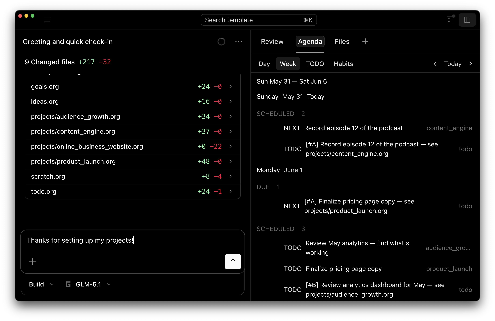

  

AI-org, a fork of opencode optimized for org-mode.

  
  

  <a href="README.md">English</a> |
  <a href="README.zh.md">简体中文</a> |
  <a href="README.zht.md">繁體中文</a> |
  <a href="README.ko.md">한국어</a> |
  <a href="README.de.md">Deutsch</a> |
  <a href="README.es.md">Español</a> |
  <a href="README.fr.md">Français</a> |
  <a href="README.it.md">Italiano</a> |
  <a href="README.da.md">Dansk</a> |
  <a href="README.ja.md">日本語</a> |
  <a href="README.pl.md">Polski</a> |
  <a href="README.ru.md">Русский</a> |
  <a href="README.bs.md">Bosanski</a> |
  <a href="README.ar.md">العربية</a> |
  <a href="README.no.md">Norsk</a> |
  <a href="README.br.md">Português (Brasil)</a> |
  <a href="README.th.md">ไทย</a> |
  <a href="README.tr.md">Türkçe</a> |
  <a href="README.uk.md">Українська</a> |
  <a href="README.bn.md">বাংলা</a> |
  <a href="README.gr.md">Ελληνικά</a> |
  <a href="README.vi.md">Tiếng Việt</a>

---

## Heads up — the repo isn't the whole product

You're looking at the source code, which is free. But if you actually want to be productive with this tool immediately, you should probably go to **[ai-org.net](https://ai-org.net)** cause you'll get:

- **Desktop builds** — Mac, Windows, Linux, no terminal needed
- **`AGENTS.md` & `HUMAN.md`** — these are actually pretty crucial. they're the project scaffolding that makes AI coding work reliably instead of sporadically, and they come filled out in a PARA structure project ready to go
- **Clean user's guide** — so you're not digging through source code to figure out config

The code alone won't get you far. Those files will.

---

- Website: [ai-org.net](https://ai-org.net)
- Discord: [discord.gg/HrhjpDUnRE](https://discord.gg/HrhjpDUnRE)
- Contact: [matt@masoftware.net](mailto:matt@masoftware.net)

© 2026 MA Software. All rights reserved.
